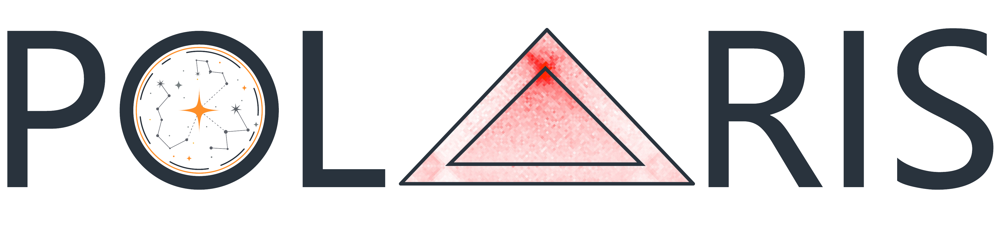

🌐 [**Project page**](https://ai4nucleome.github.io/Polaris/) &nbsp;|&nbsp; 📝 [**Documentation**](https://nucleome-polaris.readthedocs.io/en/latest) &nbsp;|&nbsp; 📚 [**Tutorials**](https://github.com/ai4nucleome/Polaris/tree/master/example) &nbsp;|&nbsp; 🤗 [**Hugging Face**](https://huggingface.co/rr-ss/Polaris) (model weights & example data) &nbsp;|&nbsp; 📦 [**Reproducibility**](https://zenodo.org/records/14294273)



# A Universal Framework for Chromatin Loop Annotation from Bulk and Single-cell Contact Maps

<div style="text-align: center;">
    <a href="https://github.com/ai4nucleome/Polaris">README (EN)</a>  &nbsp;&nbsp;&nbsp; &nbsp;&nbsp;&nbsp; &nbsp;&nbsp;&nbsp; &nbsp;&nbsp;&nbsp; &nbsp;&nbsp;&nbsp;     
    <a href="https://github.com/ai4nucleome/Polaris/tree/master/doc">README (CN)</a>
</div>


&nbsp;&nbsp;&nbsp; 

<div style="text-align: center;">
    <a href="https://github.com/ai4nucleome/Polaris/releases/latest">
   
   
   
   <!--  -->
</a>  
</div>


🌟 **Polaris** is a versatile and efficient command line tool tailored for rapid and accurate chromatin loop detection from contact maps generated by various assays, including bulk Hi-C, scHi-C, Micro-C, and DNA SPRITE. Polaris is particularly well-suited for analyzing **sparse scHi-C data and low-coverage datasets**.

<div style="text-align: center;">
    
</div>


## 📚 Tutorials
Step-by-step walkthroughs with example data and expected outputs are provided in the [**`example/`**](https://github.com/ai4nucleome/Polaris/tree/master/example) folder:

| Tutorial | Content |
|---|---|
| [**Loop annotation**](https://github.com/ai4nucleome/Polaris/tree/master/example/loop_annotation) | Annotate loops from a contact map: three equivalent workflows (`loop pred`; `loop score` + `loop pool`; `loop scorelf` for large maps), with example data and output format. |
| [**Aggregate peak analysis**](https://github.com/ai4nucleome/Polaris/tree/master/example/APA) | Pile up the contact signal at annotated loops with `polaris util pileup`. |
| [**CLI walkthrough**](https://github.com/ai4nucleome/Polaris/blob/master/example/CLI_walkthrough.ipynb) | Overview of all Polaris commands and options. |

The scripts and data to **reproduce the analyses in our paper** are available at [**Polaris Reproducibility**](https://zenodo.org/records/14294273).

> ❗️<b>NOTE❗️:</b> We suggest users run Polaris on <b>GPU</b>. 
> You can run Polaris on CPU for loop annotations, but it is much slower than on GPU. 
> If you encounter a `CUDA OUT OF MEMORY` error, please: 
> - Check your GPU's status and available memory.
> - Reduce the --batchsize parameter. (The default value of 128 requires approximately 36GB of CUDA memory. Setting it to 24 will reduce the requirement to less than 10GB.)

## [📝Documentation](https://nucleome-polaris.readthedocs.io/en/latest/)
 **Detailed documentation** can be found at: [Polaris Doc](https://nucleome-polaris.readthedocs.io/en/latest/).

## Installation
Polaris is developed and tested on Linux machines with python3.9 and relies on several libraries including pytorch, scipy, etc. 
We **strongly recommend** that you install Polaris in a virtual environment.

We suggest users using [conda](https://anaconda.org/) to create a virtual environment for it (It should also work without using conda, i.e. with pip). You can run the command snippets below to install Polaris:

```bash
git clone https://github.com/ai4nucleome/Polaris.git
cd Polaris
conda create -n polaris python=3.9
conda activate polaris
```
-------
### Package dependencies
Polaris relies on the following packages:
```setuptools==75.1.0
appdirs==1.4.4
click==8.0.1
cooler==0.8.11
matplotlib==3.8.0
numpy==1.22.4
pandas==1.3.0
scikit-learn==1.4.2
scipy==1.7.3
timm==0.6.12
tqdm==4.65.0
```
Please install PyTorch == 2.2.2 according to its official [documentation](https://pytorch.org/get-started/previous-versions/). We recommend using [PyTorch 2.2.2](https://pytorch.org/get-started/previous-versions/#linux-and-windows-23) for best compatibility.


### Install Polaris:
```bash
./setup.sh
```
It will automatically download Polaris model's weights from [Hugging Face](https://huggingface.co/rr-ss/Polaris) and install Polaris.

You can also download model's weights file manually from [there](https://huggingface.co/rr-ss/Polaris/resolve/main/polaris/model/sft_loop.pt?download=true) and put it in `Polaris/polaris/model` and change the file name to `sft_loop.pt`.


The installation requires network access to download libraries. Usually, the installation will finish within 3 minutes. The installation time is longer if network access is slow and/or unstable.

## Quick Start for Loop Annotation
**Detailed documentation** can be found at 🛜 **this link**: [Polaris Doc](https://nucleome-polaris.readthedocs.io/en/latest/) 🛜.

**For detailed documentation or parameter setting, please run:**
```bash
polaris --help
```
or **check the instruction [here](https://nucleome-polaris.readthedocs.io/en/latest/)**.

---
To quick run **Polaris** at **5kb** resolution with **default parameters**, you can use the command snippets below:
```bash
polaris loop pred -i [input contact map] -o [output path of annotated loops]
```
`-i` indicates the path of the input contact map (a multi-resolution cooler `.mcool` or band cooler `.bcool` file); `-o` indicates the path of the output file of detected loops in `.bedpe` format. With default parameters, Polaris detects loops from the input contact map at **5kb** resolution for all autosomes.

### Single-cell Hi-C
The command for **scHi-C is identical** to bulk: you only prepare the input differently. Aggregate contact maps from cells of the same type into a single **pseudo-bulk** `.mcool` (e.g. by summing per-cell `.cool` files with [`cooler merge`](https://cooler.readthedocs.io), or from a `.scool`), then run the same command. Polaris annotates loops from as few as **~25 cells**.

### Subcommands
| Command | Purpose |
|---|---|
| `polaris loop pred`    | Annotate loops directly (scoring + clustering in one step). |
| `polaris loop score`   | Output a per-pixel loop-score file. |
| `polaris loop pool`    | Cluster a loop-score file into discrete loops. |
| `polaris loop scorelf` | Memory-efficient scoring for very large / high-coverage / high-resolution maps. |
| `polaris util pileup`  | Aggregate peak analysis (APA) of a loop set. |

The more **detailed parameter instructions** can be found at this link: 🛜 [Polaris Doc at ReadTheBook](https://nucleome-polaris.readthedocs.io/en/latest/CLI_reference.html#) 🛜

---
### output format
It contains tab separated fields as follows:
```
Chr1    Start1    End1    Chr2    Start2    End2    Score
```
|     Field     |                                  Detail                                 |
|:-------------:|:-----------------------------------------------------------------------:|
|   Chr1/Chr2   | chromosome names                                                        |
| Start1/Start2 | start genomic coordinates                                               |
|   End1/End2   | end genomic coordinates (i.e. End1=Start1+resol)                        |
|     Score     | Polaris's loop score [0~1]                                              | 


## Citation:
Yusen Hou, Audrey Baguette, Mathieu Blanchette*, & Yanlin Zhang*. __A versatile tool for chromatin loop annotation in bulk and single-cell Hi-C data__. _bioRxiv_, 2024. [Paper](https://doi.org/10.1101/2024.12.24.630215)
<br>
```
@article {Hou2024Polaris,
	title = {A versatile tool for chromatin loop annotation in bulk and single-cell Hi-C data},
	author = {Yusen Hou, Audrey Baguette, Mathieu Blanchette, and Yanlin Zhang},
	journal = {bioRxiv}
	year = {2024},
}
```

## 📩 Contact
A GitHub issue is preferable for all problems related to using Polaris. 

For other concerns, please email Yusen Hou or Yanlin Zhang (yhou925@connect.hkust-gz.edu.cn,  yanlinzhang@hkust-gz.edu.cn).