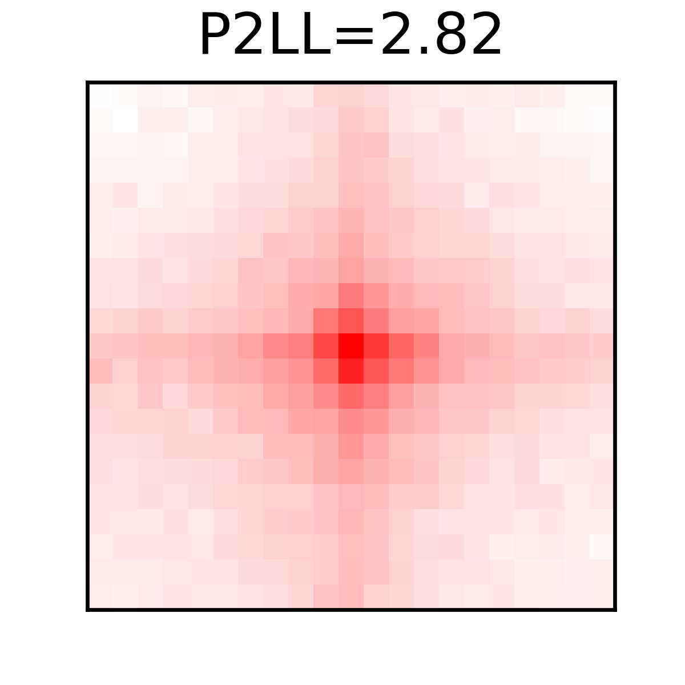

# Aggregate Peak Analysis (APA) Example

Aggregate peak analysis (APA) piles up the observed/expected contact signal around a set of loops and reports their average enrichment, providing a quick visual check that annotated loops are genuinely enriched for chromosomal interactions. This example runs APA on the loops produced by the [loop annotation example](../loop_annotation).

## Command

```bash
polaris util pileup --savefig ./GM12878_250M_chr151617_loops.pileup.png --p2ll True \
    ../loop_annotation/GM12878_250M_chr151617_loops.bedpe \
    ../loop_annotation/GM12878_250M.bcool
```

- **first positional argument:** the loop `.bedpe` file to pile up
- **second positional argument:** the contact map (`.mcool` or `.bcool`)
- `--p2ll True` annotates the peak-to-lower-left (P2LL) ratio on the plot
- `--savefig` writes the figure to the given path

Run `polaris util pileup --help` for all options.

## Output

`GM12878_250M_chr151617_loops.pileup.png` — the APA heatmap (provided in this folder):

<p align="center">
  
</p>
