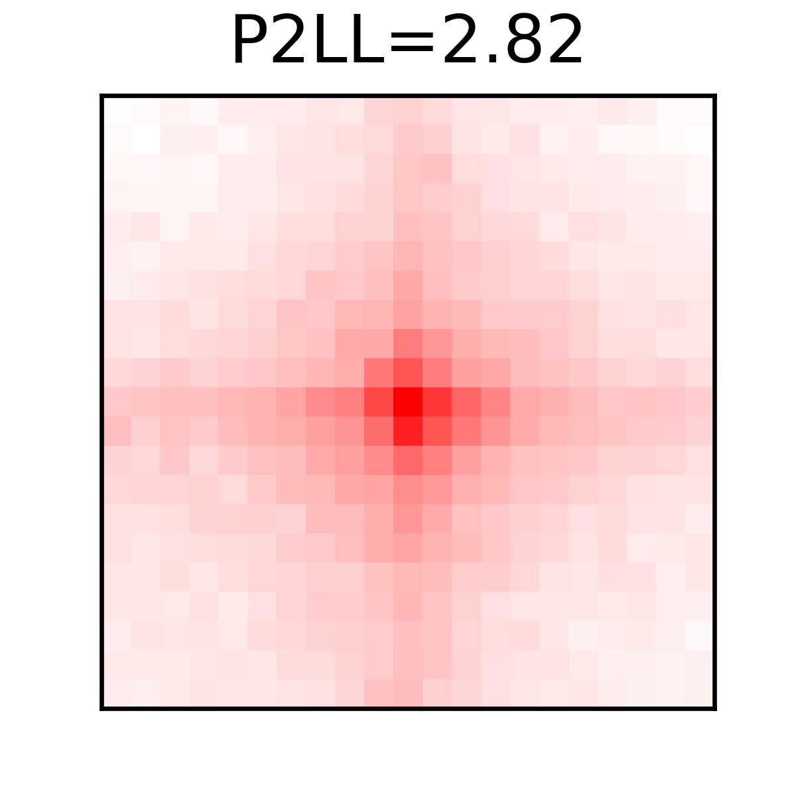

# Example Use of Loop Annotaion and APA 

This folder contains two subfolders that showcase example results of **Polaris** on loop prediction and aggregated peak analysis.

You can re-run **Polaris** to reproduce these results by following the commands provided in the sections below.

> **Note:** If you encounter a `CUDA OUT OF MEMORY` error, please:
> - Check your GPU's status and available memory.
> - Reduce the --batchsize parameter. (The default value of 128 requires approximately 36GB of CUDA memory. Setting it to 24 will reduce the requirement to less than 10GB.)

## Loop Prediction on GM12878 (250M Valid Read Pairs)

You can download example data from the [Hugging Face repo of Polaris](https://huggingface.co/rr-ss/Polaris/resolve/main/example/loop_annotation/GM12878_250M.bcool?download=true) by runing:
```bash
wget https://huggingface.co/rr-ss/Polaris/resolve/main/example/loop_annotation/GM12878_250M.bcool?download=true -O "./GM12878_250M.bcool"
```
And run following code to annotate loops from the example data:
```bash
polaris loop pred --chrom chr15,chr16,chr17 -i ./loop_annotation/GM12878_250M.bcool -o ./loop_annotation/GM12878_250M_chr151617_loops.bedpe
```

The [loop_annotation](https://github.com/compbiodsa/Polaris/tree/master/example/loop_annotation) sub-folder contains the results on bulk Hi-C data of GM12878 (250M valid read pairs).


## APA of Loops Detected by Polaris

``` bash
polaris util pileup --savefig ./APA/GM12878_250M_chr151617_loops.pileup.png --p2ll True ./loop_annotation/GM12878_250M_chr151617_loops.bedpe ./loop_annotation/GM12878_250M.bcool
```

The [APA](https://github.com/compbiodsa/Polaris/tree/master/example/APA) sub-folder contains the Aggregate Peak Analysis result of loops detected on GM12878 (250M Valid Read Pairs) by Polaris.

<div style="text-align: center;">
    <figure>
        
        <figcaption>APA of loops on GM12878 (250M Valid Read Pairs)</figcaption>
    </figure>
</div>


---
- **Extensive documentation** can be found at: [Polaris Documentaion](https://nucleome-polaris.readthedocs.io/en/latest/).
- You can find more detailed tutorials in the **Jupyter Notebooks located within the respective subfolders**.