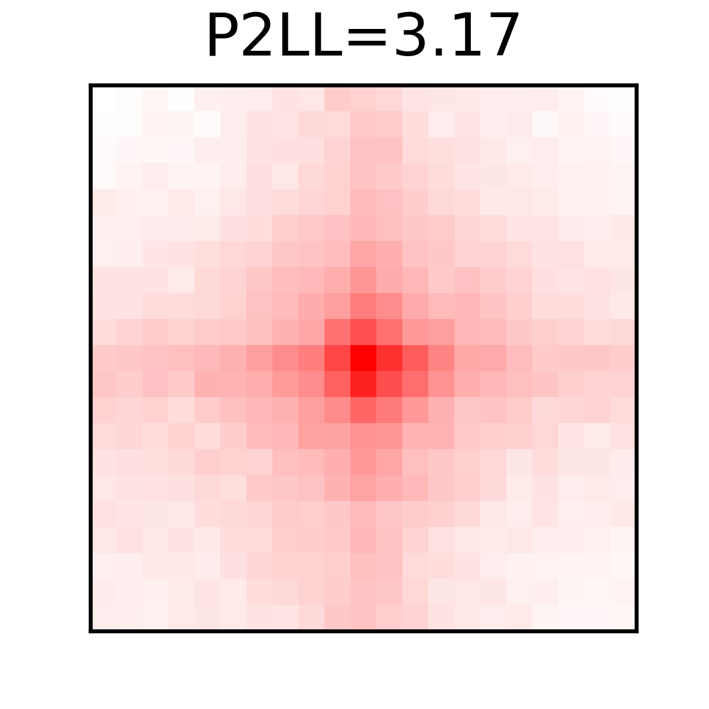
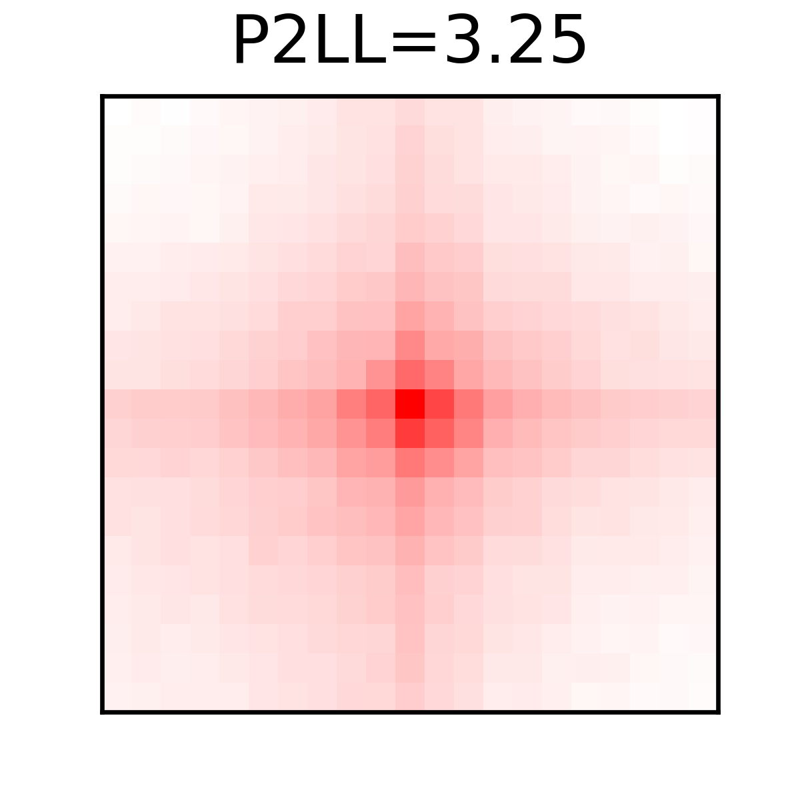

# Examples on Bulk and Single-cell Hi-C Data

This folder contains two subfolders that showcase example results of **Polaris** on Bulk and Superimposed Single-cell Hi-C Data.

You can re-run **Polaris** to reproduce these results by following the commands provided in the sections below.

> **Note:** If you encounter a `CUDA OUT OF MEMORY` error, please:
> - Check the status of your GPU.
> - Try decreasing the `--batchsize` parameter.

## Bulk Hi-C Data of GM12878 (250M Valid Read Pairs)

```bash
polaris loop pred --chrom chr15,chr16,chr17 -i ./GM12878/GM12878_250M.bcool -o ./GM12878/GM12878_250M_chr151617_loops.bedpe
polaris util pileup --savefig ./GM12878/GM12878_250M_chr151617_loops.pileup.png --p2ll True ./GM12878/GM12878_250M_chr151617_loops.bedpe ./GM12878/GM12878_250M.bcool
```

The GM12878 sub-folder contains the results on bulk Hi-C data of GM12878 (250M valid read pairs), along with the Aggregate Peak Analysis result.

<div style="text-align: center;">
    
</div>

## Single-cell Hi-C Data of mESCs

```bash
polaris loop pred --chrom chr1,chr2,chr3,chr4,chr5,chr6,chr7,chr8,chr9,chr10,chr11,chr12,chr13,chr14,chr15,chr16,chr17,chr18,chr19 -i ./scHiC/400_cells_superimposed.mcool -o ./scHiC/400_cells_superimposed_autosomes_loops.bedpe
polaris util pileup --savefig ./scHiC/400_cells_superimposed_autosomes_loops.pileup.png --p2ll True ./scHiC/400_cells_superimposed_autosomes_loops.bedpe ./scHiC/400_cells_superimposed.mcool
```

The scHiC sub-folder contains the results on Single-cell Hi-C Data of mESCs, along with the Aggregate Peak Analysis result.

<div style="text-align: center;">
    
</div>

---
**Extensive documentation** can be found at:  .